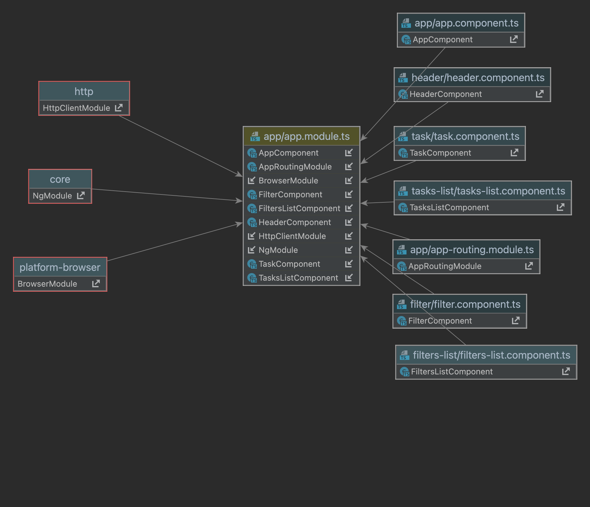

# TodoList

This project was generated with [Angular CLI](https://github.com/angular/angular-cli) version 16.1.8 and consists of a TODO LIST with filters and edition options.

This is the general architecture of the application

## Getting started
1. To ensure that you have `Node 18.10.0`. We recommend to use `nvm`, so you can run `nvm use` to select the correct node version based on the `.nvmrc` file.
2. Run `npm install`.
3. Run `npm start`. That way, you start the local database that uses json server and the local server.
4. Go to `localhost:4200` and enjoy the app.

## Running unit tests
Unit tests are based on Jest, you just have to run `npm run test`.

Alternatively you have the option `npm run test:watch` to work in live when your tests are failing.

## Running end-to-end tests
Unit tests are based on Cypress, you just have to run `npm run e2e`

After that, you will see a screen to select the platform(Chrome, Firefox, Electron) to launch the tests, and you will be able to select the test that you want to run.
